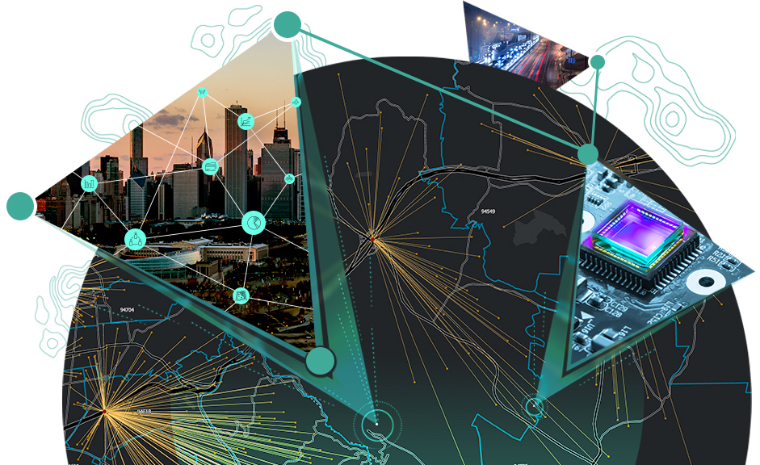

# suvamp.github.io
My personal website featuring projects

## Education/Background
My name is Suvam Patel. I am currently a graduate student at [California State University, Los Angeles](https://www.calstatela.edu) ([Department of Geosciences and Environment](https://www.calstatela.edu/nss/geosciences)). I am interested in researching shoreline geomorphology and automating shoreline extracting in Google Earth Engine.

